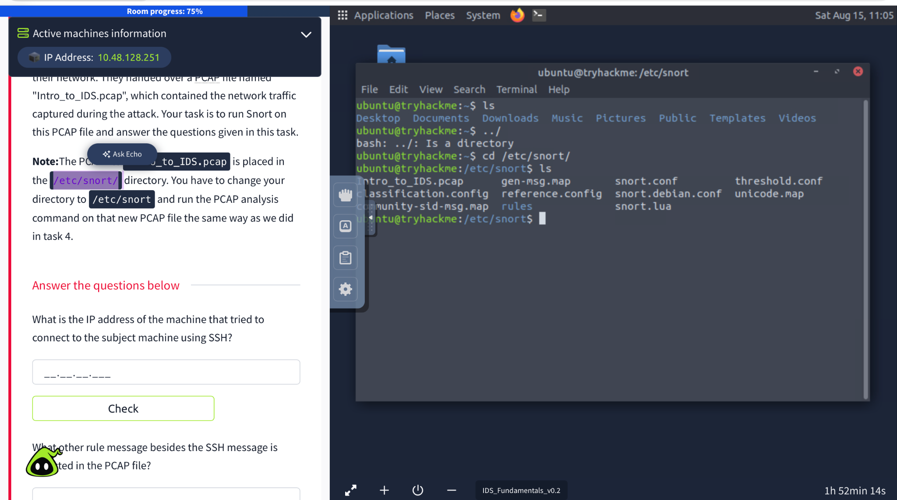
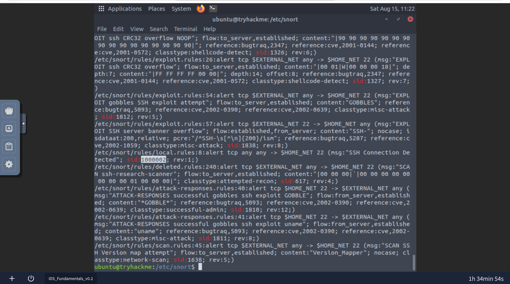
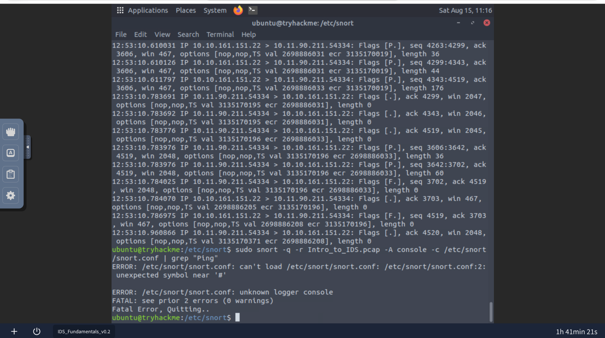

# Snort IDS – Network Traffic & PCAP Analysis

> A practical network intrusion-detection case study focused on SSH connection detection, ICMP activity, and Snort rule analysis.

## Analyst

**Md Obaydur Rahman**  
**Cybersecurity Analyst – Network Security & Intrusion Detection**

---

## Overview

This project documents a hands-on investigation of a supplied network capture using **Snort**, **tcpdump**, and command-line analysis.

Rather than treating the exercise as a simple question-and-answer walkthrough, this repository presents the work as a small **cybersecurity case study**: identifying relevant traffic, validating the source of an SSH connection attempt, reviewing Snort detection rules, and documenting the evidence behind the findings.

The investigation was performed in a controlled educational/lab environment.

---

## Investigation Objectives

The investigation focused on:

- Identifying the source host associated with an SSH connection attempt
- Reviewing additional network activity detected in the capture
- Identifying the Snort rule responsible for SSH detection
- Verifying the corresponding Snort SID
- Preserving the investigation evidence through screenshots and command output
- Documenting the analysis in a professional, reproducible format

---

## Environment & Tools

| Tool | Purpose |
|---|---|
| **Snort** | Intrusion detection and rule analysis |
| **tcpdump** | Command-line packet inspection |
| **grep** | Searching Snort rules and configuration |
| **PCAP analysis** | Network traffic investigation |

**PCAP analyzed:** `Intro_to_IDS.pcap`

---

## Investigation Methodology

The investigation followed a simple evidence-based workflow:

1. Locate and review the supplied PCAP.
2. Isolate traffic associated with TCP port 22.
3. Determine which host initiated the SSH connection.
4. Review Snort rule definitions related to SSH.
5. Verify the rule message and SID.
6. Review additional detection activity in the capture.
7. Document the findings with supporting evidence.

---

## Technical Analysis

### 1. SSH Traffic Analysis

SSH commonly operates over TCP port 22. The PCAP was filtered for traffic associated with that port:

```bash
sudo tcpdump -nn -r Intro_to_IDS.pcap 'tcp port 22'
```

The captured traffic was then reviewed to determine the source of the connection attempt.

### Evidence



---

### 2. Snort SSH Detection Rule

The Snort rule files were searched for the SSH detection message:

```bash
grep -Ri 'SSH Connection Detected' /etc/snort/rules/
```

To extract the SID directly:

```bash
grep -Ri 'SSH Connection Detected' /etc/snort/rules/ | grep -o 'sid:[0-9]*'
```

### Evidence



---

### 3. Additional Detection Activity

The investigation also identified ping/ICMP-related activity associated with the **Ping Detected** alert.

The Snort rule files can be searched with:

```bash
grep -Ri 'Ping Detected' /etc/snort/rules/
```

---

## Findings

### Finding 01 – SSH Connection Attempt

Analysis of TCP/22 traffic identified:

**Source IP:** `10.11.90.211`

This address was associated with the host initiating the SSH connection attempt toward the subject machine.

### Finding 02 – Additional Network Activity

A separate ICMP/ping-related detection was identified.

**Detection:** `Ping Detected`

### Finding 03 – SSH Detection Rule

The Snort rule responsible for the SSH alert contains the message:

**`SSH Connection Detected`**

The associated Snort SID is:

**`1000002`**

---

## Evidence Summary

| Evidence | Result |
|---|---|
| SSH source IP | `10.11.90.211` |
| Additional alert | `Ping Detected` |
| SSH rule message | `SSH Connection Detected` |
| SSH rule SID | `1000002` |
| PCAP | `Intro_to_IDS.pcap` |

---

## Analyst Note

During the investigation, the supplied `snort.conf` produced a configuration parsing error.

Instead of modifying the original lab configuration, I continued the investigation using direct PCAP inspection and targeted searches of the Snort rule files. This kept the analysis focused on the evidence already provided and was sufficient to verify the required findings.



---

## Conclusion

The investigation successfully identified `10.11.90.211` as the source associated with the SSH connection attempt.

The analysis also confirmed ping-related detection activity and verified that the Snort rule for **SSH Connection Detected** uses **SID `1000002`**.

This exercise provided practical experience in:

- PCAP analysis
- Network traffic investigation
- SSH traffic identification
- Snort rule interpretation
- Intrusion detection
- Command-line security analysis
- Evidence-based reporting

---

## Project Files

```text
snort-ids-pcap-analysis/
│
├── README.md
├── PROJECT_INFO.md
├── .gitignore
│
├── report/
│   └── Snort_IDS_GitHub_Portfolio_Report_Md_Obaydur_Rahman.docx
│
├── screenshots/
│   ├── ssh-traffic.png
│   ├── snort-error.png
│   └── ssh-rule-sid.png
│
└── evidence/
    └── commands.txt
```

The `report/` directory contains the full professional report with screenshots and investigation notes.

---

## Disclaimer

This project was performed in a controlled educational/lab environment for cybersecurity learning and portfolio documentation. The IP addresses and network traffic discussed in this repository belong to the supplied exercise data.
